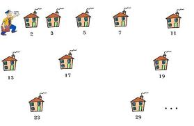

# Deserto dos Números Primos
CEFET-MG

 
 
</a> 

 

 

	O trabalho Deserto dos Números Primos consiste em uma espécie de calculadora que exibe o maior intervalo entre números primos seguidos em um delimitado tamanho de busca.

 

	Quanto maior a quantidade inicial de números analisados, maior é o intervalo entre os números primos (deserto entre eles).

